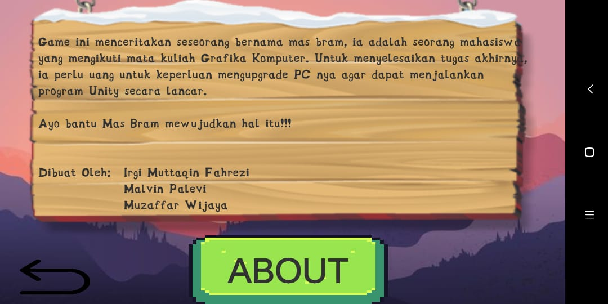
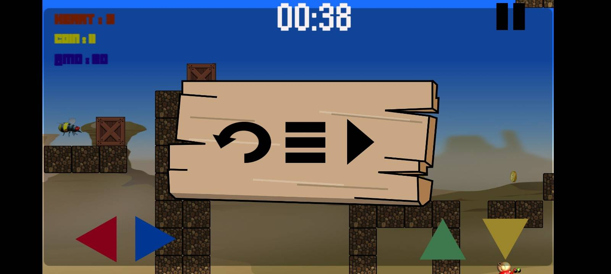
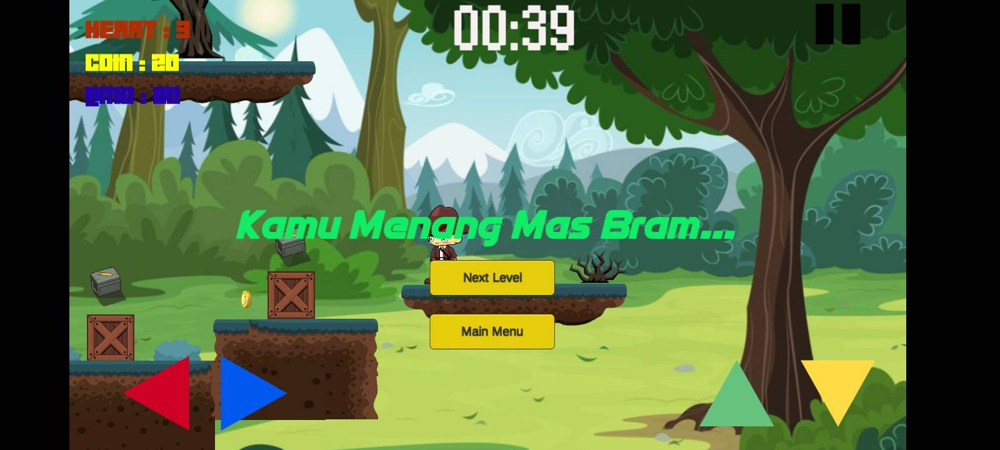
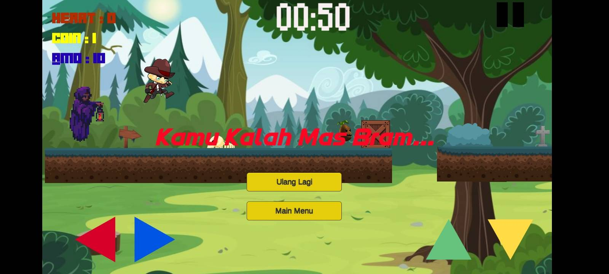

# MAS BRAM MENCARI CUAN
## TEAM

 Irgi Muttaqin Fahrezi     G64190006 as Game Programmer 
 

 Malvin Palevi             G64190038 as Game Designer 

 Muzaffar Wijaya         G64190058 as Game Artist

## Tema: LIVE ON LAND

## STORY
Mas Bram adalah seorang mahasiswa jurusan Ilmu Komputer dan dia sedang menempuh mata kuliah GRAFIKA KOMPUTER. Pada matkul ini diwajibkan untuk mendownload Unity sebagai media belajar. Namun, dikarenakan PC mas Bram kurang memadai untuk itu dia terpaksa untuk mencari cuan di dungeon ini dengan berlari dan melompat lalu melewati monster monster yang ada.

## RULES
<ol>
  <li> Player mengumpulkan koin/cuan dengan jumlah tertentu yang sudah di tentukan di setiap stagenya. </li>
  <li> PLayer membaca pesan yang ditampilkan di setiap stage oleh NFT. </li>
<li> Player mengumpulkan coin dengan estimasi waktu tertentu yang mana makin cepat jika stage makin tinggi. </li>
<li> Stage 1 -> Player mengumpulkan 20 coin untuk lanjut ke stage berikutnya dengan berlari dan melompat menghindari monster. </li>
<li> Stage 2 -> Player mengumpulkan 25 coin untuk lanjut ke stage berikutnya dengan berlari dan melompat menghindari monster. </li>
<li> Terdapat hambatan berupa bom, apabila ikan terkena bom sebanyak 3x maka permainan akan berakhir (game over). </li>

</ol>
  
## GOALS
<ul>
<li>  Player/ Mas Bram mengumpulkan coin yang sudah ditentukan di setiap stage </li>
<li>  Player menghindari monster saat berlari mengumpulkan coin </li>
<li>  Player mengumpulkan coin dengan estimasi waktu tertentu yang mana makin cepat jika stage makin tinggi </li>
</ul>

## PLATFORM
<ul>
  <li> Android </li>
</ul>

## HOW TO PLAY
<ul>
  <li> Gunakan tombol yang tersedia pada layar hp untuk bermain </li>
</ul>
 
## ASSETS
<a href ="https://drive.google.com/drive/folders/1w5vY9sW9iSEs8Y1TuXdGCFYfbEZIAiu2?usp=sharing"> https://drive.google.com/drive/folders/1w5vY9sW9iSEs8Y1TuXdGCFYfbEZIAiu2?usp=sharing </a></td>

## TECHNOLOGY STACK
<ul>
  <li> Adobe Photoshop </li>
  <li> Unity </li>
  <li> Visual Studio </li>
 </ul>
 
## Informasi Proyek
<table>
  <tr>
    <td> Github </td>
    <td>  <a href ="https://github.com/geem168/Mas-Bram-Nyari-Cuan">  https://github.com/geem168/Mas-Bram-Nyari-Cuan </a></td>
  </tr>
  <tr>
    <td> Docs Laporan </td>
    <td> <a href ="https://docs.google.com/document/d/1V87gFeT8dewNSW61gqdqQWR3Mj-cLKSev2ioEa6qDw8/edit?usp=sharing" > https://docs.google.com/document/d/1V87gFeT8dewNSW61gqdqQWR3Mj-cLKSev2ioEa6qDw8/edit?usp=sharing </a> </td>
  </tr>
  <tr>
    <td> Video Demo </td>
    <td>  <a href ="https://drive.google.com/file/d/1gMpmpcphfsBgFlkVUER7__abFYnvMEJC/view?usp=sharing">  https://drive.google.com/file/d/1gMpmpcphfsBgFlkVUER7__abFYnvMEJC/view?usp=sharing </a></td>
  </tr>
  </table>
    
 ## Tampilan Game
 1. Tampilan loading

2. Main Menu

3. About yang berisi informasi game

4. Select Level

5. Level 1

6. Level 2

7. Pause

8. Notifikasi Menang

9. Notifikasi Kalah

10. Notifikasi Waktu Habis

